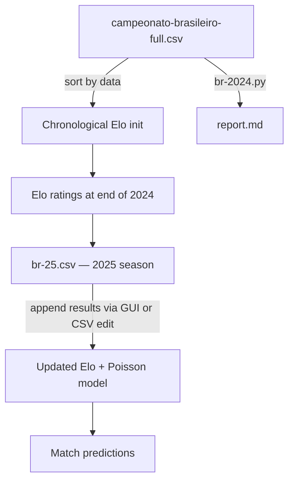

Sassamaru BR-25 uses two CSV files at different scopes. `br-25.csv` tracks the current season as it unfolds, while `campeonato-brasileiro-full.csv` provides the multi-year history used to initialise Elo ratings and run backtests.

## The two CSV files

<Columns cols={2}>
  <Card title="br-25.csv" icon="calendar" href="/data/data-format">
    The active 2025 season dataset. Results are appended via the GUI or by editing the file directly as each round is played.
  </Card>
  <Card title="campeonato-brasileiro-full.csv" icon="database" href="/data/normalization">
    Full multi-year history of the Campeonato Brasileiro. Used for Elo initialisation, backtesting, and the `br-2024.py` report.
  </Card>
</Columns>

### Column differences

`br-25.csv` contains the four required columns (`mandante`, `visitante`, `gols_mandante`, `gols_visitante`). The full historical file adds three more:

| Column | Description |
|---|---|
| `resultado` | Match result string such as `"2-1"`. |
| `vencedor` | Winner name, or `'-'` for a draw. |
| `data` | Match date string, parsed with `dayfirst=True`. |

## Chronological Elo processing

Elo ratings are stateful: each match updates both teams' ratings, and the updated values feed into the next match. Processing matches out of order produces incorrect ratings.

The model reads the `data` column from the full historical dataset and sorts rows by date before iterating:

```python
df['data'] = pd.to_datetime(df['data'], dayfirst=True)
df = df.sort_values('data')
```

<Note>
The `dayfirst=True` flag is required because dates in the dataset follow the Brazilian DD/MM/YYYY convention. Without it, pandas may misparse dates like `03/07/2023` as March 7 instead of July 3.
</Note>

Matches are then processed in order from oldest to newest. After every match, both teams' Elo ratings are updated using the standard Elo formula weighted by the goal difference. By the time the model reaches round 1 of the 2025 season, each team's Elo reflects its entire tracked history.

## Focus clubs

The model tracks a focused set of clubs for detailed per-club reporting. These are the clubs with the largest supporter bases and the most complete historical records in the dataset:

```python
FOCUS_CLUBS = [
    "flamengo", "fluminense", "vasco", "botafogo",
    "palmeiras", "sao paulo", "santos", "corinthians",
    "atletico mineiro", "cruzeiro", "gremio", "internacional"
]
```

For each focus club the model can report:

- Current Elo rating and trajectory over the season.
- Expected goals (xG) averages as home and away team.
- Head-to-head Poisson win probability against any other club.

<Tip>
The focus club list uses lowercase names that match the CSV storage format. If you add a club, use the same lowercase spelling you use in `br-25.csv` and ensure a mapping exists in `NORMALIZATION_MAP` for display purposes.
</Tip>

## The `br-2024.py` report

`br-2024.py` runs against `campeonato-brasileiro-full.csv` and generates `report.md` — a Markdown summary of the completed 2024 Campeonato Brasileiro season.

The report includes:

- **Final Elo standings** — all clubs ranked by their end-of-season Elo rating.
- **Top attackers** — clubs with the highest average goals scored per match.
- **Strongest defences** — clubs with the lowest average goals conceded.
- **Home advantage analysis** — comparison of home vs away win rates across the season.
- **Focus club deep-dives** — per-club win/draw/loss breakdowns, average goals, and Elo delta from start to end of season.
- **Prediction accuracy** — retrospective comparison of model-predicted outcomes against actual results for calibration.

To regenerate the report after adding new historical data:

```bash
python br-2024.py
```

The output is written to `report.md` in the same directory.

<Note>
`report.md` is a generated file. Do not edit it manually — any changes will be overwritten the next time `br-2024.py` runs. Customise the report by modifying the script instead.
</Note>

## Data flow overview



---

<Columns cols={2}>
  <Card title="Data format" icon="file-csv" href="/data/data-format">
    CSV column schema and how to add new match results.
  </Card>
  <Card title="Normalization" icon="arrow-right-arrow-left" href="/data/normalization">
    Team name normalisation and dataset validation.
  </Card>
</Columns>
